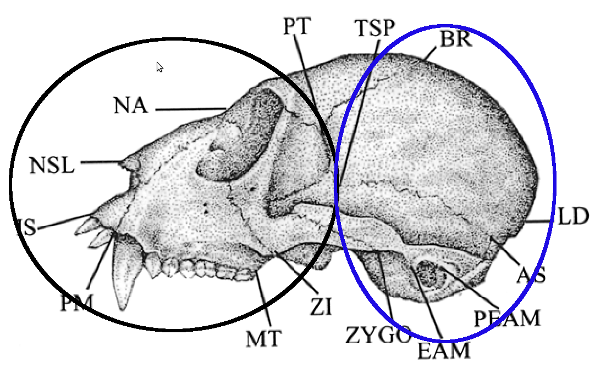

% Apostila de Biologia Evolutiva - BIO507
% Diogo Melo; Gabriel Marroig; Monique Simon
% 6 de junho de 2013

#Introdução

<!--Isso é um comentário, não vai aparecer no arquivo final-->
<!--Exemplo de figura:-->
<!---->
<!--Ai no texto vc pode se referir a figura como \ref{nomedafigura}-->

<!--Exemplo de referencia:-->
<!--Wagner e Falconer é legal [@Wagner1984; @Falconer1996]-->

O objetivo dessa apostila é explorar os princípios da genética
quantitativa, passando pelos tipos de dados tratados, sua descrição
analise, e como isso se insere na teoria evolutiva moderna.

#Caracteres Contínuos

Quais tipos de caracteres são usados na genética quantitativa?
Como escolher caracteres?
Homologia.

##Distâncias e Vetores

Uma vez escolhidos quais serão os caracteres usados no estudo,
precisamos fazer as medidas e representar esses dados de forma
conveniente.
Existem diversas formas de tomar dados quantitativos, para distâncias
podemos usar paquímetros, réguas, programas de computador que podem
obter distâncias de imagens bidimensionais ou representações
tridimensionais, digitalizadores digitais; além disso, podemos tomar
medidas como peso, com uma balança; expressão gênica, quantidade de
RNA mensageiro, concentração de proteínas, atividade enzimática, todos
com técnicas de biologia molecular; pigmentação ou brilho podem ser
quantificados digitalmente.
Todos esses dados representam medias continuas, potencialmente
herdáveis, que portanto podem ser estudadas dentro do paradigma da
genética quantitativa.

Com os dados em mão, podemos representá-los matematicamente.
A maneira mais conveniente de fazer isso é utilizando o conceito de um vetor.
A figura \ref{vetores} ilustra a representação de um par de medidas
utilizando um vetor bidimensional.
A partir dessa abstração, podemos construir uma teoria bastante completa.

No plano $(x,y)$ representado na figura \ref{vetores}, podemos
representar qualquer combinação de tamanhos do braço e do antebraço.
Por exemplo, na convenção da figura \ref{vetores}, um individuo com
15 cm de braço e 20 cm de antebraço é representando pelo vetor $(20,
15)$.
Qualquer fenótipo do tamanho desses dois ossos pode ser descrito por um
par de números.
Como todos os fenótipos possíveis estão representados nesse plano, ele
é chamado de morfoespaço.

No morfoespaço bidimensional, ou mesmo tridimensional, os vetores
representando os fenótipos podem ser visualizados com facilidade.
Porém, em genética quantitativa, é comum trabalharmos com um número
muito maior de medidas, chegando até centenas variáveis observadas em
cada indivíduo.
Ainda assim, podemos continuar representando nossos indivíduos por
vetores, agora compostos por muito mais números, representando todas as
medidas tomadas.
Para 4 medidas, por exemplo, os vetores são listas de 4 números,
como $(4.94, 9.94, 15.11, 20.17)$, cada um representando um dado
caráter de um indivíduo.
O morfoespaço nesse caso seria um hiperplano com 4 dimensões.

Vetores podem representar também mudanças em fenótipos.
Suponha que a média bivariada de uma população tenha se alterado
entre os momentos a e b, passando de $\overline z_a=(10, 50)$ para $\overline z_b=(15, 47)$.
Essa mudança pode ter uma série de motivos, um episodio de seleção
direcional ou um gargalo populacional, por exemplo.
Podemos representar essa mudança na média como um vetor:

$$
\overline z_b - \overline z_a = \Delta \overline z_{ba} = (15, 47)_b - (10, 50)_a = (5, -3)
$$

Ou seja, o primeiro caráter aumentou em 5 unidades na sua média,
enquanto o segundo caráter diminuiu em 3 unidades.
O vetor de mudança, $\Delta \overline z$, representa matematicamente o
evento evolutivo.

##Comparação de Vetores

Frequentemente estaremos interessados em comparar vetores.
Por exemplo, será que as mudanças nas médias de duas populações
foram na mesma direção do morfoespaço?
Caso não tenham sido, quão diferentes são elas?
Nas próximas seções, veremos casos onde essas perguntas aparecem de
forma bastante natural em outros contextos.
Para isso, precisamos de uma forma de comparar vetores, tanto em suas
magnitude quando em suas direção.
A figura \ref{deltazes} mostra algumas possibilidades para as
diferenças entre vetores de mudanças evolutivas de duas populações.

Vemos, então, que uma forma natural de comparar vetores é
representando-os pela sua magnitude e direção.

###Magnitude ou norma de vetores

Para calcular a magnitude de um vetor, podemos nos valer da teorema de
Pitágoras para triângulos retângulos (figura \ref{pitagoras}).
Para um vetor $\Delta z$ com componentes $(\Delta z_x, \Delta z_y)$,
podemos calcular sua norma (ou magnitude) $|\Delta z|$ como:

$$
|\Delta z| = \sqrt{\Delta z_x^2 + \Delta z_y^2}
$$

A boa notícia é que essa formula continua valendo para dimensionalidades altas.
Suponha que queiramos calcular a norma de um vetor em 4 dimensões
$\Delta z = (\Delta z_x, \Delta z_y, \Delta z_z, \Delta z_w)$.
A conta seria simplesmente:

$$
|\Delta z| = \sqrt{\Delta z_x^2 + \Delta z_y^2+ \Delta z_z^2 + \Delta z_w^2}
$$

Para um vetor de dimensionalidade arbitraria $\mathbf{x} = (x_1, x_2,
\cdots, x_p)$, sua norma pode ser expressa como:

$$
|\mathbf{x}| = \sqrt{\sum_{i=1}^p x_i^2}
$$

###Correlação de vetores

Além de comparações de magnitudes, podemos comparar vetores pelo
angulo formado entre eles, ou seja, a diferença em suas direções.
Uma escala bastante conveniente é a do cosseno do angulo formado entre
dois vetores.
Caso eles tenham a mesma direção, o cosseno do angulo entre eles é
um, caso eles tenham direções completamente ortogonais, ou seja, um
angulo de 90 graus entre deles, o cosseno do angulo é zero.
Caso os vetores apontem para direções opostas, formando um angulo de
180 graus, o cosseno do angulo entre eles é -1.
O cosseno do angulo entre dois vetores também é chamado de
correlação de vetores.
Para calcular o cosseno do angulo entre dois vetores a partir de
suas componentes, devemos fazer uso da lei dos cossenos (figura
\ref{leidoscossenos}).
Utilizando a notação da figura \ref{leidoscossenos}, a correlação
entre os vetores $\Delta z_1 = (x_1, y_1)$ e $\Delta z_2 = (x_2, y_2)$
seria:

$$
Corr(\Delta z_1, \Delta z_2) = cos(\alpha) = \frac{(x_1  x_2) + (y_1  y_2)}{|\Delta z_1|  |\Delta z_2|} = \frac{(x_1  x_2) + (y_1  y_2)}{\sqrt{x_1^2 + y_1^2}  \sqrt{x_2^2 + y_2^2}}
$$

Em outras palavras, o cosseno do angulo $\alpha$ é calculado como a
soma dos produtos cruzados entre os dois vetores dividido pela sua
norma.
O termo de soma dos produto cruzados, $(x_1 x_2) + (y_1 y_2)$, é
conhecido como o produto escalar entre dos vetores, e pode ser
generalizado para um numero arbitrário de dimensões.
Para dois vetores $\mathbf{x} = (x_1, x_2, \cdots, x_p)$ e $\mathbf{y} =
(y_1, y_2, \cdots, y_p)$, o seu produto escalar é definido como:

$$
\mathbf{x} \cdot \mathbf{y} = \sum_{i=1}^p x_iy_i
$$

Com isso, podemos definir a correlação de vetores de qualquer dimensão como:

$$
Corr(\mathbf{x}, \mathbf{y}) = \frac{\mathbf{x} \cdot \mathbf{y}}{|\mathbf{x}||\mathbf{y}|}
$$

###Normalização de vetores

Para populações uma mesma espécie, onde os indivíduos são
relativamente parecidos, a magnitude de um vetor de mudança evolutiva
traz informações importantes quando comparamos populações nas suas
mudanças evolutivas.
No entanto, se vamos trabalhar com espécies de tamanhos e níveis de
variações muito diferentes, comparar a magnitude da resposta passa a
ser pouca informativa.
Esse efeito é claro quando pensamos, por exemplo, na escala geral das
diferentes espécies.
Um variação de 1cm no tamanho médio do antebraço de uma população
de cavalos pode ser insignificante, mas uma mudança de mesmo tamanho em
uma população de camundongos é brutal.
Nesse caso, comparar a direção da resposta evolutiva é a única métrica que
faz sentido biológico.
Quando estamos interessados somente na direção dos vetores estudados, é
conveniente, então, padronizar a magnitude dos vetores de todas as
populações ou espécies envolvidas na analise.
Normalmente modificamos os vetores para que eles tenham magnitude
unitária, ou seja, igual a 1.
Esse procedimento é chamado de normalização, e se $\mathbf{x_N}$ é
normalizado, então $|\mathbf{x_N}| = 1$.

Suponha que $\mathbf{x}$ seja um vetor não normalizado (então
$|\mathbf{x}| \neq 1$), como fazemos para obter sua versão normalizada
$\mathbf{x_N}$?
Basta dividir todos os elementos de $\mathbf{x}$ por $|\mathbf{x}|$!
Note que:

$$
|\mathbf{x}| = \sqrt{\sum_{i=1}^p x_i^2}
$$

Então:

$$
|\mathbf{x_N}| = \left| \frac{\mathbf{x}}{|\mathbf{x}|} \right| = \sqrt{\sum_{i=1}^p \left (\frac{x_i}{|\mathbf{x}|} \right )^2} = \frac{1}{|\mathbf{x}|} \sqrt{\sum_{i=1}^p x_i^2} = \frac{|\mathbf{x}|}{|\mathbf{x}|} = 1
$$

Outra vantagem de usar vetores normalizados é na hora do calculo de suas correlações.
Se $\mathbf{x}$ e $\mathbf{y}$ são normalizados, sua correlação é simplesmente seu produto interno (ou a soma dos seus produtos cruzados), pois:

$$
Corr(\mathbf{x}, \mathbf{y}) = \frac{ \mathbf{x} \cdot \mathbf{y} }{|\mathbf{x}||\mathbf{y}|} = \frac{ \mathbf{x} \cdot \mathbf{y} }{1 \cdot 1} =  \mathbf{x} \cdot \mathbf{y} = \sum_{i=1}^p x_iy_i
$$

##Variâncias, Covariâncias e Correlações

###Um caráter

REESCREVER

Variação é o combustível da evolução, queimado nas fogueiras da seleção (WOOA!).
Quantificar variação é uma tarefa complicada.
Mesmo trabalhando com apenas um caráter, existem muitas possibilidades.

REESCREVER

A variância é uma medida comum, que quantifica desvios de cada
indivíduo em relação à média global.
A variância de um caráter contínuo $z$, expresso em uma população
com $n$ indivíduos $z_1$ a $z_n$, e média $\overline z$, é dada por:

$$
var(z) = \frac{1}{n-1}\sum_{i=1}^n (z_i - \overline z)^2
$$

O procedimento para calculo da variância é, então, bastante simples:
basta calcular a diferença de cada indivíduo da média, elevar essas
diferenças ao quadrado, e somar todas.

Como as diferenças da média são elevadas ao quadrado, a variância
tem unidades quadráticas em relação às unidades iniciais.
Ou seja, se estamos trabalhando com distâncias, e medindo os caracteres
em cm, a variância tem unidades de cm$^2$.
Alternativamente, podemos trabalhar com a raiz quadrada da variância,
chamada desvio padrão, que tem unidades iguais às medidas originais e
frequentemente é mais simples de ser interpretada intuitivamente.
Em uma distribuição normal, 95% dos indivíduos se encontra a uma
distância de, no máximo, 2 desvios padrões da média.
Ainda outra possibilidade, caso queiramos comparar populações com
escalas muito distintas, é medir variação em uma escala adimensional.
Um exemplo de estatística adimensional de variação é o coeficiente
de variação, que nada mais é que a razão entre o desvio padrão e a
média da população.
Para caracteres ósseos de mamíferos, esperamos um coeficiente de
variação por volta de 0.1, ou seja, o desvio padrão é cerca de 10%
dá média.
Essas regras gerais podem ser bastante úteis quando confrontados
com dados pela primeira vez, pois permitem rapidamente identificar
particularidades ou erros nas medidas.

###Mais de um caráter

Quando trabalhamos com mais de um caráter, além de quantificar a
variância individual de cada um, devemos também medir a interação
entre eles.
Esse tipo de medida é fundamental no estudo de modularidade, como
veremos nas próximas seções.
Como a variação entre vários caracteres pode ser estruturada.
Diferença entre covariância e correlação.

##Matrizes

Organizando as descrições de variação em matrizes.

##Comparação de Matrizes

Comparando padrões e estruturas.

#Equação do Criador

$R = h^2S$

##Médias

##Diferencial de Seleção

##Herdabilidade

###Partição de variância

###Efeitos genéticos

Valor média do alelo, efeitos aditivos, efeitos de dominância e epistasia.

#A Equação de Lande

$\Delta z = G\beta$

##$\Delta z$

##$\beta$

##Matriz

###Matriz Genética

###Matriz Fenotípica

#Modularidade e Integração 

Na imensa maioria dos organismos, conseguimos identificar partes
relativamente discretas e separadas, frequentemente envolvidas no
desempenho de alguma função.
Em organismos unicelulares podemos distinguir organelas desempenhando
funções específicas, bem como regiões internas ou na membrana
responsáveis por processos distintos.
Já nos multicelulares, tipos celulares são organizados em tecidos
espacialmente separados, formando órgãos de funções distintas, que
por sua vez são organizados em sistemas responsáveis por funções
distintas.
Modularidade se refere a esse padrão de organização dos seres vivos,
onde algumas partes são mais relacionadas entre si do que com outras
partes do mesmo organismo.
Podemos descrever, e entender, a organização entre partes
constituintes dos organismos através das relações entre elas,
sendo cada tipo de relação adequada a um nível de complexidade ou
organização.
As partes do organismo as quais nos referimos podem ser as
bases nitrogenadas de uma molécula de RNA [@Ancel2000], genes
[@Costanzo2010], proteínas [@Han2004], ou caracteres morfológicos, como
temos visto até agora [@Klingenberg2008; @Porto2009; @Marroig2009].
Essas relações podem ser medidas de diversas formas, como interação
física entre proteínas, padrões de expressão conjunta entre genes,
ou, no nosso caso, correlação entre caracteres quantitativos.
Esse grupo de características muito relacionadas entre si constituem um
módulo, como esquematizado na figura \ref{modulos}.
Módulos, então, são caracterizados por uma alta conectividade interna e
relativa independência de outros módulos.

![Representação esquemática da organização modular dos seres
  vivos. As setes representam qualquer tipo de relação entre as partes
  de um indivíduo. Adaptado de [@Klingenberg2008]. \label{modulos}](./figuras/modulos.png)

Podemos classificar os tipos de módulos de acordo com o tipo de
interação que o define [@Wagner2007].
Porém, todos os níveis de modularidade estão relacionados, e não
podemos tratar de um sem considerar o outro.

Módulo funcional:

:   Alguns caracteres agem conjuntamente no desempenho de funções
    biológicas.
    Pensando no crânio de mamíferos, os ossos da região da face
    estão envolvidos em diversas funções, como mastigação, olfação ou
    visão.
    No caso da mastigação, por exemplo, se espera que as mandíbulas
    inferiores e superiores trabalhem de forma conjunta no desempenho
    dessa função, e isso impõem restrições na forma e tamanho dos
    ossos envolvidos nessa tarefa.
    Já os ossos que compõem o neurocrânio estão relacionados com
    a proteção do cérebro dos mamíferos, e não tem relação direta com a
    mastigação.
    Essa separação em regiões funcionais diferentes tem consequências
    para o organismo.

Módulo de desenvolvimento:

:   Durante o desenvolvimento, caracteres podem se comportar de forma
    quase autônoma dentro de um embrião com relação aos seus processos
    de crescimento e diferenciação.
    Ou ainda, genes e proteínas podem estar envolvidos em uma cascata
    autônoma de sinalização que faz parte do desenvolvimento do
    organismo.
    Voltando ao exemplo acima dos dois módulos
    funcionais nos mamíferos, estes mesmos módulos possuem origem
    embrionária distinta.
    O desenvolvimento da face dos mamíferos provém do crescimento e
    da diferenciação de células da mesoderme paraxial, enquanto que
    o desenvolvimento do neurocrânio se dá a partir das células da
    crista neural.
    Esses dois tecidos embrionários não influenciam o desenvolvimento
    um do outro, portanto são partes praticamente autônomas do
    embrião.
    Assim, os dois módulos funcionais, face e neurocrânio dos
    mamíferos, também são dois módulos de desenvolvimento distintos.

Módulo variacional:

:   Os módulos variacionais são caracterizados por correlações
    altas entre caracteres dentro do módulo e correlações baixas entre
    caracteres de módulos diferentes.
    Enquanto as definições de módulos funcionais e de desenvolvimento
    referem-se a fenômenos do indivíduo, o módulo variacional é um
    fenômeno populacional.
    Apesar dos caracteres pertencerem a organismos individuais, suas
    correlações só podem ser determinadas em um estudo populacional.
    As correlações encontradas refletem organizações modulares tanto
    no desenvolvimento quanto na estrutura genética dos indivíduos, e são
    moldadas por demandas evolutivas [@Klingenberg2008].

##Integração Morfológica

No contexto de caracteres contínuos, a teoria da integração
morfológica foi inicialmente elaborada por Olson e Miller [-@Olson1958]
em seu livro "Integração Morfológica".
Neste livre, os autores apresentam a integração morfológica como
uma forma de estudar a evolução dos animais como organismos totais,
concebendo-os como uma abstração baseada em associações de medidas
[@Olson1958].
Estas associações de medidas são representadas por correlações
fenotípicas e organizadas em módulos variacionais.
A relevância em se investigar complexos de caracteres em vez de
caracteres isolados está na visão de que mudanças em um caráter
podem não ser independentes de mudanças em outros caracteres do
organismo [@Lande1979].
Olson e Miller já ponderavam sobre as relações
entre magnitude de integração e evolução.
Seria a intensidade de integração, ou seja, o quão fortemente os
caracteres estão associados entre si, capaz de influenciar a evolução
de organismos mais complexos e seu grau de adaptabilidade?
Pensando em magnitudes de integração, esses autores compreenderam a
importância da dualidade integração-modularidade no potencial de
evolução morfológica, ou seja, que esses dois conceitos são os dois
lados de uma mesma moeda.
Modularidade permite com que caracteres se comportem de forma
independente, enquanto integração garante que mudanças em um caráter
sejam coordenadas com mudanças nos demais caracteres que interagem com
o primeiro.
Na próxima seção vamos discutir essa dualidade em detalhes num
contexto evolutivo.

Günter P. Wagner [-@Wagner1996] ressaltou que é preciso haver uma
razão biológica para que o plano corpóreo dos organismos seja
organizado de maneira tão obviamente modular, tornando facilmente
reconhecíveis suas unidades naturais (como mostrado pela nossa
capacidade de apontar estruturas homólogas).
Para ele, considerar as unidades naturais como unidades de
transformação evolutiva (ou seja, a modularidade como uma propriedade
variacional do genoma) traz o sentido biológico dessa organização.
Segundo ele, três critérios precisam ser satisfeitos para um complexo
de caracteres ser considerado como uma unidade modular: (1) servir a uma
função primária; (2) ser integrado por efeitos pleiotrópicos; e (3)
ser relativamente independente de outras unidades.
A visão de Wagner leva a uma estrutura particular do mapa
genótipo-fenótipo dentro de um individuo, no qual genes estariam
divididos em grupos com efeitos pleiotrópicos localizados, restritos a
caracteres envolvidos com uma determinada função.
Essa organização modular do mapa genótipo-fenótipo seria responsável
ela organização dos caracteres em módulos variacionais.

![Mapa genótipo-fenótipo modular clássico, e mapa incluindo
efeitos do desenvolvimento. Adaptado de [@Klingenberg2008].
\label{mapagenfen}](./figuras/mapgenfen.png)

##Consequências Evolutivas

##Autovalores e Autovetores

##Tamanho

#Bibliografia
