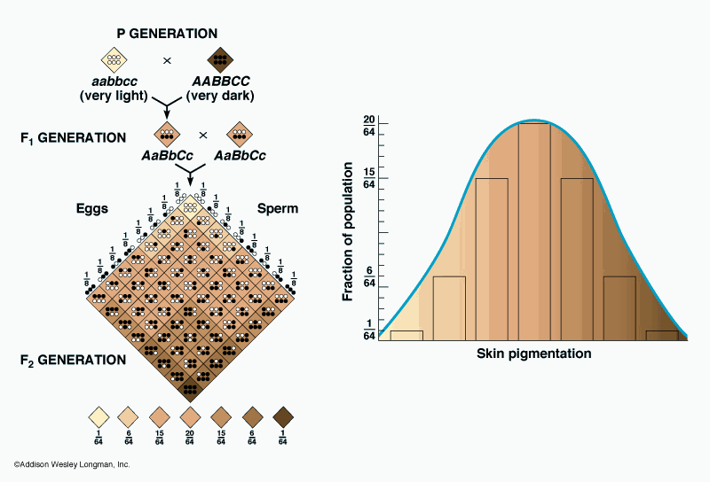
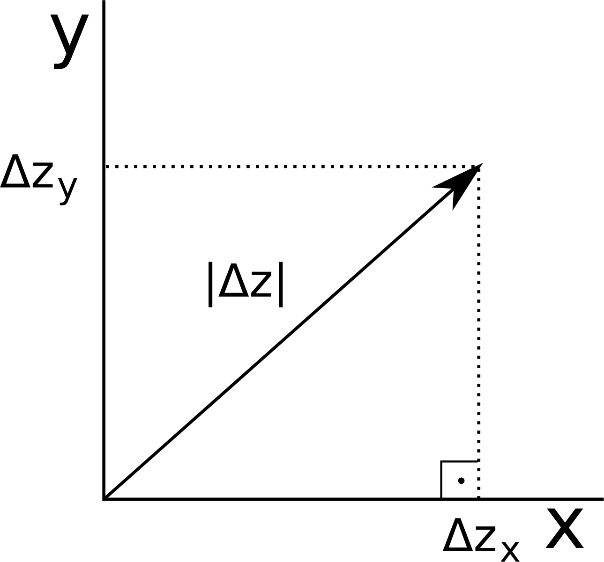
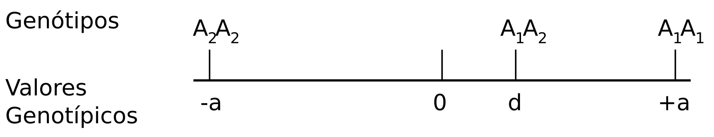

% Apostila de Biologia Evolutiva - BIO507
% Diogo Melo; Gabriel Marroig; Monique Simon
% 6 de junho de 2013

#Introdução

O objetivo dessa apostila é explorar os princípios da Genética
Quantitativa, passando pelos tipos de dados tratados, sua descrição e
análise, e como isso se insere na teoria evolutiva moderna.
A teoria da Genética Quantitativa refere-se à herança de caracteres
contínuos, nos quais as diferenças entre indivíduos são
quantitativas e não qualitativas [@Falconer1996].
Como exemplo, podemos pensar no caráter "altura" em uma determinada
população, e verificar que ele possuí uma distribuição contínua de
valores individuais, não apenas tipos distintos separados em classes
bem definidas (como textura por exemplo, lisa ou rugosa).
A compreensão da herança dos caracteres contínuos é de fundamental
importância para a teoria evolutiva, pois diferenças individuais
quantitativas constituem a base na qual a seleção natural pode atuar
e promover mudanças entre as gerações de uma população[@Falconer1996].

#Um pouco de história

Antes de adentrarmos nos princípios e conceitos da Genética Quantitativa, vamos
aprender um pouco sobre o contexto histórico no qual a teoria se desenvolveu.
O desabrochar da Genética Quantitativa está intimamente relacionado com a
elaboração da própria Síntese Moderna e grandes nomes da biologia participaram
nesse desenrolar da área.
Os princípios da teoria foram desenvolvidos por volta da década de
1920, em resposta a uma histórica controvérsia na teoria evolutiva
referente à aparente incompatibilidade entre a genética mendeliana e a
escola biométrica.
A primeira lidava com a herança de caracteres discretos por meio da
segregação independente dos alelos, de um ou mais loci, e o cálculo
de razões mendelianas para expressar as proporções de diferentes
genótipos da prole gerada a partir de combinações particulares
de genótipos parentais.
Os mendelianos defendiam que o aparecimento de novas macromutações
(mutações de grande efeito) propiciava variação nos caracteres
discretos e sua evolução.
Já a escola biométrica, liderada por Karl Pearson e W.F.R. Weldon,
focava na herança de caracteres contínuos e na ideia de evolução
como resultado da seleção natural atuando em sua distribuição.
Pearson elaborou diversos métodos para se estudar a variação de
caracteres contínuos, como as teorias de regressão e de correlação.
O grande debate entre as duas linhas de pensamento recaia sobre a
dúvida de os caracteres discretos possuírem as mesmas propriedades de
hereditariedade e evolução que os caracteres contínuos [@Lynch1998].
A reconciliação foi alcançada pelos trabalhos independentes de Ronald
Fisher, J.B.S. Haldane e Sewall Wright, culminando na elaboração da Síntese
Moderna da teoria evolutiva.
Fisher (1918) demonstrou que os resultados obtidos pelos biometricistas
podiam ser derivados de princípios mendelianos, postulando a existência
de múltiplos alelos atuando sobre um único caráter (Fig. \ref{variosloci}).
Nesse artigo, ele introduz o conceito de partição de variância,
que permite a discriminação de efeitos genéticos e ambientais na
distribuição dos caracteres, extensivamente utilizado na genética
quantitativa.
Os trabalhos clássicos em genética de populações de Fisher, Haldane e Wright
demonstraram que a seleção natural pode funcionar com os tipos de variação
observados em populações naturais e com as leis de herança mendelianas
[@Ridley1996]. Com  o debate entre mendelianos e biometricistas resolvido, a
biologia pôde ser unificada no eixo comum da teoria evolutiva, permitindo o
aprofundamento dos estudos em genética de populações e genética quantitativa em
temas macroevoutivos, como especiação por exemplo.

#Princípios matemáticos em Genética Quantitativa

Para podermos usar a teoria da Genética Quantitativa no estudo das propriedades
genéticas e da evolução de caracteres contínuos em populações, precisamos
lançar mão de certos princípios matemáticos relacionados com variação, como
média, variância e covariância, e relacionados com a representação destes em um
morfoespaço, como vetores e matrizes.

##Caracteres contínuos

Agora que temos uma noção do que são e como podem ser herdados os caracteres
contínuos, podemos pensar em quais critérios podemos utilizar para escolher os
caracteres em um estudo.
É preciso garantir que as medidas que se realizam em um indivíduo (ou em
indivíduos de uma espécie) representem os mesmos caracteres nos outros
indivíduos (ou nos indivíduos das outras espécies, no caso de estudos
macroevolutivos). Esse cuidado precisa ser tomado para que a variação que se
observa nos dados (que é o foco dos estudos quantitativos) não tenha uma fonte
a mais de erro referente a heterogeneidade de caracteres medidos entre
indivíduos ou entre espécies.
O critério fundamental para garantirmos que são os mesmos caracteres em todos
os indivíduos é o de homologia.
Nós reconhecemos estruturas homólogas por serem discretas e reconhecíveis em
todos os indivíduos [@Zelditch].
Homologia implica em uma mesma origem ancestral do caráter, e dessa maneira,
podemos estudar diferenças em caracteres homólogos em um contexto evolutivo
usando de informações de parentesco dos indivíduos amostrados.

##Distâncias e Vetores

Uma vez escolhidos quais serão os caracteres usados no estudo,
precisamos fazer as medidas e representar esses dados de forma
conveniente.
Existem diversas formas de tomar dados quantitativos: para distâncias
podemos usar paquímetros, réguas, programas de computador que podem
obter distâncias de imagens bidimensionais ou representações
tridimensionais, digitalizadores digitais; além disso, podemos tomar
medidas como peso, com uma balança; expressão gênica, quantidade de
RNA mensageiro, concentração de proteínas, atividade enzimática, todos
com técnicas de biologia molecular; pigmentação ou brilho podem ser
quantificados digitalmente.
Todos esses dados representam medidas contínuas, potencialmente
herdáveis, que portanto podem ser estudadas dentro do paradigma da
genética quantitativa.

Com os dados em mão, podemos representá-los matematicamente.
A maneira mais conveniente de fazer isso é utilizando o conceito de um vetor.
A figura \ref{vetores} ilustra a representação de um par de medidas
utilizando um vetor bidimensional.
A partir dessa abstração, podemos construir uma teoria bastante completa.

No plano $(x,y)$ representado na figura \ref{vetores}, podemos
representar qualquer combinação de tamanhos do braço e do antebraço.
Por exemplo, na convenção da figura \ref{vetores}, um individuo com
15 cm de braço e 20 cm de antebraço é representando pelo vetor $(20,
15)$.
Qualquer fenótipo do tamanho desses dois ossos pode ser descrito por um
par de números.
Como todos os fenótipos possíveis estão representados nesse plano, ele
é chamado de morfoespaço.

No morfoespaço bidimensional, ou mesmo tridimensional, os vetores
representando os fenótipos podem ser visualizados com facilidade.
Porém, em genética quantitativa, é comum trabalharmos com um número
muito maior de medidas, chegando até centenas variáveis observadas em
cada indivíduo.
Ainda assim, podemos continuar representando nossos indivíduos por
vetores, agora compostos por muito mais números, representando todas as
medidas tomadas.
Para 4 medidas, por exemplo, os vetores são listas de 4 números,
como $(4.94, 9.94, 15.11, 20.17)$, cada um representando um dado
caráter de um indivíduo.
O morfoespaço nesse caso seria um hiperplano com 4 dimensões.

Vetores podem representar também mudanças em fenótipos.
Suponha que a média bivariada de uma população tenha se alterado
entre os momentos a e b, passando de $\overline z_a=(10, 50)$ para $\overline z_b=(15, 47)$.
Essa mudança pode ter uma série de motivos, um episodio de seleção
direcional ou um gargalo populacional, por exemplo.
Podemos representar essa mudança na média como um vetor:

$$
\overline z_b - \overline z_a = \Delta \overline z_{ba} = (15, 47)_b - (10, 50)_a = (5, -3)
$$

Ou seja, o primeiro caráter aumentou em 5 unidades na sua média,
enquanto o segundo caráter diminuiu em 3 unidades.
O vetor de mudança, $\Delta \overline z$, representa matematicamente o
evento evolutivo.

##Comparação de Vetores

Frequentemente estaremos interessados em comparar vetores.
Por exemplo, será que as mudanças nas médias de duas populações
foram na mesma direção do morfoespaço?
Caso não tenham sido, quão diferentes são elas?
Nas próximas seções, veremos casos onde essas perguntas aparecem de
forma bastante natural em outros contextos.
Para isso, precisamos de uma forma de comparar vetores, tanto em suas
magnitude quando em suas direção.
A figura \ref{deltazes} mostra algumas possibilidades para as
diferenças entre vetores de mudanças evolutivas de duas populações.

Vemos, então, que uma forma natural de comparar vetores é
representando-os pela sua magnitude e direção.

###Magnitude ou norma de vetores

Para calcular a magnitude de um vetor, podemos nos valer da teorema de
Pitágoras para triângulos retângulos (figura \ref{pitagoras}).
Para um vetor $\Delta z$ com componentes $(\Delta z_x, \Delta z_y)$,
podemos calcular sua norma (ou magnitude) $|\Delta z|$ como:

$$
|\Delta z| = \sqrt{\Delta z_x^2 + \Delta z_y^2}
$$

A boa notícia é que essa formula continua valendo para dimensionalidades altas.
Suponha que queiramos calcular a norma de um vetor em 4 dimensões
$\Delta z = (\Delta z_x, \Delta z_y, \Delta z_z, \Delta z_w)$.
A conta seria simplesmente:

$$
|\Delta z| = \sqrt{\Delta z_x^2 + \Delta z_y^2+ \Delta z_z^2 + \Delta z_w^2}
$$

Para um vetor de dimensionalidade arbitraria $\mathbf{x} = (x_1, x_2,
\cdots, x_p)$, sua norma pode ser expressa como:

$$
|\mathbf{x}| = \sqrt{\sum_{i=1}^p x_i^2}
$$

###Correlação de vetores

Além de comparações de magnitudes, podemos comparar vetores pelo
angulo formado entre eles, ou seja, a diferença em suas direções.
Uma escala bastante conveniente é a do cosseno do angulo formado entre
dois vetores.
Caso eles tenham a mesma direção, o cosseno do angulo entre eles é
um, caso eles tenham direções completamente ortogonais, ou seja, um
angulo de 90 graus entre deles, o cosseno do angulo é zero.
Caso os vetores apontem para direções opostas, formando um angulo de
180 graus, o cosseno do angulo entre eles é -1.
O cosseno do angulo entre dois vetores também é chamado de
correlação de vetores.
Para calcular o cosseno do angulo entre dois vetores a partir de
suas componentes, devemos fazer uso da lei dos cossenos (figura
\ref{leidoscossenos}).
Utilizando a notação da figura \ref{leidoscossenos}, a correlação
entre os vetores $\Delta z_1 = (x_1, y_1)$ e $\Delta z_2 = (x_2, y_2)$
seria:

$$
Corr(\Delta z_1, \Delta z_2) = cos(\alpha) = \frac{(x_1  x_2) + (y_1  y_2)}{|\Delta z_1|  |\Delta z_2|} = \frac{(x_1  x_2) + (y_1  y_2)}{\sqrt{x_1^2 + y_1^2}  \sqrt{x_2^2 + y_2^2}}
$$

Em outras palavras, o cosseno do angulo $\alpha$ é calculado como a
soma dos produtos cruzados entre os dois vetores dividido pela sua
norma.
O termo de soma dos produto cruzados, $(x_1 x_2) + (y_1 y_2)$, é
conhecido como o produto escalar entre dos vetores, e pode ser
generalizado para um numero arbitrário de dimensões.
Para dois vetores $\mathbf{x} = (x_1, x_2, \cdots, x_p)$ e $\mathbf{y} =
(y_1, y_2, \cdots, y_p)$, o seu produto escalar é definido como:

$$
\mathbf{x} \cdot \mathbf{y} = \sum_{i=1}^p x_iy_i
$$

Com isso, podemos definir a correlação de vetores de qualquer dimensão como:

$$
Corr(\mathbf{x}, \mathbf{y}) = \frac{\mathbf{x} \cdot \mathbf{y}}{|\mathbf{x}||\mathbf{y}|}
$$

###Normalização de vetores

Para populações uma mesma espécie, onde os indivíduos são
relativamente parecidos, a magnitude de um vetor de mudança evolutiva
traz informações importantes quando comparamos populações nas suas
mudanças evolutivas.
No entanto, se vamos trabalhar com espécies de tamanhos e níveis de
variações muito diferentes, comparar a magnitude da resposta passa a
ser pouca informativa.
Esse efeito é claro quando pensamos, por exemplo, na escala geral das
diferentes espécies.
Um variação de 1cm no tamanho médio do antebraço de uma população
de cavalos pode ser insignificante, mas uma mudança de mesmo tamanho em
uma população de camundongos é brutal.
Nesse caso, comparar a direção da resposta evolutiva é a única métrica que
faz sentido biológico.
Quando estamos interessados somente na direção dos vetores estudados, é
conveniente, então, padronizar a magnitude dos vetores de todas as
populações ou espécies envolvidas na analise.
Normalmente modificamos os vetores para que eles tenham magnitude
unitária, ou seja, igual a 1.
Esse procedimento é chamado de normalização, e se $\mathbf{x_N}$ é
normalizado, então $|\mathbf{x_N}| = 1$.

Suponha que $\mathbf{x}$ seja um vetor não normalizado (então
$|\mathbf{x}| \neq 1$), como fazemos para obter sua versão normalizada
$\mathbf{x_N}$?
Basta dividir todos os elementos de $\mathbf{x}$ por $|\mathbf{x}|$!
Note que:

$$
|\mathbf{x}| = \sqrt{\sum_{i=1}^p x_i^2}
$$

Então:

$$
|\mathbf{x_N}| = \left| \frac{\mathbf{x}}{|\mathbf{x}|} \right| = \sqrt{\sum_{i=1}^p \left (\frac{x_i}{|\mathbf{x}|} \right )^2} = \frac{1}{|\mathbf{x}|} \sqrt{\sum_{i=1}^p x_i^2} = \frac{|\mathbf{x}|}{|\mathbf{x}|} = 1
$$

Outra vantagem de usar vetores normalizados é na hora do calculo de suas correlações.
Se $\mathbf{x}$ e $\mathbf{y}$ são normalizados, sua correlação é simplesmente seu produto interno (ou a soma dos seus produtos cruzados), pois:

$$
Corr(\mathbf{x}, \mathbf{y}) = \frac{ \mathbf{x} \cdot \mathbf{y} }{|\mathbf{x}||\mathbf{y}|} = \frac{ \mathbf{x} \cdot \mathbf{y} }{1 \cdot 1} =  \mathbf{x} \cdot \mathbf{y} = \sum_{i=1}^p x_iy_i
$$

##Variâncias, Covariâncias e Correlações

###Um caráter

O estudo dos caracteres contínuos é centrado em sua variação, uma vez que é em
termos de variação que as questões genéticas primárias são formuladas.  A
quantidade de variação é medida e expressa como a variância.
A variância é uma medida comum, que quantifica desvios de cada
indivíduo em relação à média global.
A variância de um caráter contínuo $z$, expresso em uma população
com $n$ indivíduos $z_1$ a $z_n$, e média $\overline z$, é dada por:

$$
var(z) = \frac{1}{n-1}\sum_{i=1}^n (z_i - \overline z)^2
$$

O procedimento para calculo da variância é, então, bastante simples:
basta calcular a diferença de cada indivíduo da média, elevar
essas diferenças ao quadrado, somar todas e dividir pelo número de
indivíduos menos um.

Como as diferenças da média são elevadas ao quadrado, a variância
tem unidades quadráticas em relação às unidades iniciais.
Ou seja, se estamos trabalhando com distâncias, e medindo os caracteres
em cm, a variância tem unidades de cm$^2$.
Alternativamente, podemos trabalhar com a raiz quadrada da variância,
chamada desvio padrão, que tem unidades iguais às medidas originais e
frequentemente é mais simples de ser interpretada intuitivamente.
Em uma distribuição normal, 95% dos indivíduos se encontra a uma
distância de, no máximo, 2 desvios padrões da média.
Ainda outra possibilidade, caso queiramos comparar populações com
escalas muito distintas, é medir variação em uma escala adimensional.
Um exemplo de estatística adimensional de variação é o coeficiente
de variação, que nada mais é que a razão entre o desvio padrão e a
média da população.
Para caracteres ósseos de mamíferos, esperamos um coeficiente de
variação por volta de 0.1, ou seja, o desvio padrão é cerca de 10%
dá média.
Essas regras gerais podem ser bastante úteis quando confrontados
com dados pela primeira vez, pois permitem rapidamente identificar
particularidades ou erros nas medidas.

###Mais de um caráter

Quando trabalhamos com mais de um caráter, além de quantificar a
variância individual de cada um, devemos também medir a interação
entre eles.
Esse tipo de medida é fundamental no estudo de modularidade, como
veremos nas próximas seções.

De forma análoga ao calculo da variância, a covariância mede a
variação conjunta de dois caracteres.
Para dois caráteres $z_1$ e $z_2$, expressos em uma população com
$n$ indivíduos, com médias $\overline z_1$ e $\overline z_2$, a
covariância entre eles é dada por:

$$
cov(z_1, z_2) = \frac{1}{n-1} \sum_{i=1}^n (z_{1i} - \overline z_1)(z_{2i} - \overline z_2)
$$

Ou seja, a média do produto entre as diferenças da média para
os caracteres de cada indivíduo.

Se os desvios da média dos dois caracteres forem na mesma direção, ou
seja, se um crescer ou diminuir junto com o outro em cada indivíduo, a
covariação será alta.
Ou, se os desvios forem em direções opostas, com um aumentando e o
outro diminuindo, a covariação será negativa.
Se, ainda, os desvios não tiverem relação nenhuma, desvios
coordenados e opostos tendem a se cancelar, e a covariação será
próxima de zero.

Suponha agora que estivéssemos estudando um grande número de caracteres
métricos, numerados de $1$ a $p$, que descrevem de forma completa
alguma estrutura anatômica.
O fenótipo de cada um dos $n$ indivíduos da população estudada pode ser
representado por um vetor $\mathbf{z}_j = (z_{1j}, z_{2j}, \cdots, z_{pj})$.
Como podemos descrever a variação nessa população?
Primeiro, calculamos o vetor de médias da população,
$\mathbf{\overline z} = (\overline z_1, \overline z_2, \cdots, \overline z_p)$, onde:

$$
\overline z_i = \frac{1}{n} \sum_{j=1}^n z_{ij}
$$

Lembre-se que $z_{ij}$ significa o caráter $i$ do indivíduo $j$.

Com as médias, podemos calcular a variância de cada caráter na população:

$$
var(z_i) = \frac{1}{n-1} \sum_{j=1}^n (z_{ij} - \overline z_i)^2
$$

E, como são muitos caracteres, devemos também calcular a covariâncias entre eles:

$$
cov(z_i, z_k)_{i \ne k} = \frac{1}{n-1} \sum_{j=1}^n (z_{ij} - \overline z_i)(z_{kj} - \overline z_k)
$$

Vale notar que a fórmula da covariância se torna igual a da variância quando $i=k$.

###Correlação

Assim como no caso da variância, a covariância sofre efeitos da escala
da medida em questão.
Caracteres maiores tendem a ter covariâncias mais altas que caracteres
menores.
Para contornar esse problema, podemos escalonar as covariâncias
pelas variâncias, dividindo a covariância pela raiz do produto das
variâncias.

$$
Corr(x, y) = \frac{cov(x, y)}{\sqrt(var(x)var(y))} = \frac{\sum_{i=1}^n (x_i - \overline x)(y_i - \overline y)}{(\sum_{j=1}^n (x_j - \overline x)^2\sum_{j=1}^n(y_j - \overline y)^2)^{1/2}}
$$

Como ambas as quantidades são representadas em unidades quadráticas, a
estatística resultante, chamada correlação, é adimensional e varia de -1 a 1.
Correlação zero indica que as variáveis não tem relação linear,
enquanto correlação de 1 ou -1 indica total dependência entre
as variáveis, variando da mesma direção no caso de correlação
positiva, e variando em sentido oposto no caso de correlação negativa.
Por ser adimensional e sempre variar entre -1 e 1, a correlação
pode ser comparada entre pares de caracteres ou entre populações
diferentes.

Vale ressaltar que, caso as médias das variáveis sejam zero, a formula
apresentada para correlação entre medidas se reduz à formula de correlação ou
cosseno entre vetores, justificando o uso do mesmo nome para a
correlação entre medidas e a correlação de vetores.

##Matrizes

Variâncias, covariâncias e correlações são formas de descrever a
variação de caracteres morfológicos, e, frequentemente, estudamos um
grande número de caracteres descrevendo uma estrutura complexa.
Como podemos organizar todas essas estatísticas de forma a representar a
variação de uma estrutura formada de vários caracteres?
A representação matricial resolve esse problema, além de fornecer
muitas facilidades matemáticas e computacionais no estudo da variação em
populações biológicas.

Suponha que estejamos trabalhando com dois caráteres, $x$ e $y$, medidos em
uma população qualquer que descrevem uma estrutura $z$.
Após a medição, calculamos as médias, $\overline x$ e $\overline
y$, as variâncias, $var(x)$ e $var(y)$, e, por fim, as covariâncias e
correlações $cov(x, y)$ e $corr(x, y)$.
Como esses dados seriam representados?
As médias seriam um vetor $\overline z = (\overline x, \overline y)$.
Já as variâncias e covariâncias seriam organizadas em uma matriz,
chamada matriz de variância-covariância, ou, simplesmente, matriz de
covariância.
A estrutura dessa matriz seria:

$$
Var(z) = \left (
\begin{smallmatrix}
var(x) & cov(x, y) \\
cov(x,y) & var(y)  \\
\end{smallmatrix}
\right )
$$

Ou seja, na diagonal, temos as variâncias de cada medida, e, fora da
diagonal, as covariâncias.
A matriz de correlação tem exatamente a mesma forma, porem com $1$ na
diagonal, representando a correlação de uma medida com ela mesma.

$$
Corr(z) = \left (
\begin{smallmatrix}
1 & corr(x, y) \\
corr(x,y) & 1  \\
\end{smallmatrix}
\right )
$$

Essas representações de estendem trivialmente para dimensões mais altas.
Por exemplo, se medirmos $p$ distâncias de uma estrutura $z = (z_1, z_2, \cdots, z_n)$,
sua matriz de covariância seria:

$$
Var(z) = \left (
\begin{matrix}
var(z_1) & cov(z_1, z_2) & \cdots & cov(z_1, z_p) \\
cov(z_1, z_2) & var(z_2) & \cdots & cov(z_2, z_p) \\
\vdots & \vdots  & \ddots & \vdots                \\
cov(z_1, z_p) & cov(z_1, z_p) & \cdots & var(z_p) \\
\end{matrix}
\right )
$$

##Operações com Matrizes

Para trabalhar com matrizes, precisamos relembrar algumas regras de operação matricial.
A mais simples é a soma de matrizes, que é feita simplesmente somando os elementos equivalentes.
Para somar matrizes duas matrizes $\mathbf{A}$ e $\mathbf{B}$, elas devem ter a mesma dimensão.
Por exemplo, se $\mathbf{A}$ e $\mathbf{B}$ forem matrizes $2$ por $2$:

$$
\mathbf{A} + \mathbf{B} =
\left (
\begin{matrix}
A_{11} & A_{12}\\
A_{21} & A_{22}  \\
\end{matrix}
\right )
+
\left (
\begin{matrix}
B_{11} & B_{12}\\
B_{21} & B_{22}  \\
\end{matrix}
\right )
=
 \left (
\begin{matrix}
A_{11}+B_{11} & A_{12}+B_{12}\\
A_{21}+B_{21} & A_{22}+B_{22} \\
\end{matrix}
\right )
$$

Outra operação comum é a de multiplicação de matrizes.
Essa operação já é mais complicada, e NÃO se resume apenas a
multiplicar os elementos equivalentes.
Na multiplicação de matrizes, uma dada posição é definida como
o produto escalar entre a linha equivalente da primeira matriz com a
coluna da segunda.
Ou seja, a posição $ij$ da matriz produto é o poduto escalar da linha
$i$ da primeira matriz com a coluna $j$ da segunda.
Isso significa que, em geral, $\mathbf{A}\mathbf{B}$ pode ser diferente
de $\mathbf{B}\mathbf{A}$.
Para que essa operação seja possivel, a primeira matriz deve ter o
mesmo numero que linhas que a segunda tenha de colunas.
A matriz desultante terá o mesmo numero de linhas que a primeira e o
mesmo numero de colunas que a segunda.
Se $\mathbf{A}$ for uma matriz $3$ por $2$ e $\mathbf{B}$ uma matriz $2$
por $3$, o produto entre elas seria a seguinte matrix $3$ por $3$:

$$
\mathbf{A}\mathbf{B} =
\left (
\begin{matrix}
A_{11} & A_{12} \\
A_{21} & A_{22}  \\
A_{31} & A_{32} \\
\end{matrix}
\right )
\left (
\begin{matrix}
B_{11} & B_{12} & B_{13} \\
B_{21} & B_{22} & B_{23} \\
\end{matrix}
\right )
=
\left (
\begin{smallmatrix}
A_{11}B_{11} +  A_{12}B_{21} & A_{11}B_{12} +  A_{12}B_{22} & A_{11}B_{13} +  A_{12}B_{23} \\
A_{21}B_{11} +  A_{22}B_{21} & A_{21}B_{12} +  A_{22}B_{22} & A_{21}B_{13} +  A_{22}B_{23} \\
A_{31}B_{11} +  A_{32}B_{21} & A_{31}B_{12} +  A_{32}B_{22} & A_{31}B_{13} +  A_{32}B_{23} \\
\end{smallmatrix}
\right )
$$

Na verdade, o caso mais interessante para nós será o de
multiplicação de uma matriz por um vetor, que pode ser pensado como
uma matriz de uma coluna.
A mesma regra vale, e temos, para uma matriz $\mathbf{A}$ e um vetor $\mathbf{x}$:

$$
\mathbf{A}\mathbf{x}  =
\left (
\begin{matrix}
A_{11} & A_{12} & A_{13}\\
A_{21} & A_{22} & A_{23} \\
A_{31} & A_{32} & A_{33}\\
\end{matrix}
\right )
\left (
\begin{matrix}
x_{1}  \\
x_{2}   \\
x_{3}  \\
\end{matrix}
\right )
=
\left (
\begin{matrix}
A_{11}x_{1} +  A_{12}x_{2} +  A_{13}x_{3}\\
A_{21}x_{1} +  A_{22}x_{2} +  A_{22}x_{3}\\
A_{31}x_{1} +  A_{32}x_{2} +  A_{32}x_{3}\\
\end{matrix}
\right )
$$

Uma última operação importante, que geralmente é feita de forma
exclusivamente computacional, devido à sua dificuldade operacional, é
a de inversão de matrizes.
A inversão permite definir o análogo matricial de divisão.
A inversa de uma matriz $\mathbf{A}$ é denominada $\mathbf{A}^{-1}$ e definida pela propriedade:

$$
\mathbf{A}\mathbf{A}^{-1} = \mathbf{A}^{-1}\mathbf{A} = \mathbf{I}
$$

onde $\mathbf{I}$ representa a matriz identidade, que tem apenas 1 na
diagonal e zero fora dela.
A matriz identidade é o elemento neutro da multiplicação de matrizes, ou seja:

$$
\mathbf{A}\mathbf{I} = \mathbf{I}\mathbf{A} = \mathbf{A}
$$

Isso é exatamente análogo à divisão nos numero reais, por exemplo:

$$
aa^{-1} = a^{-1}a = a\frac{1}{a} = 1
$$

como exercício, verifique que as seguintes matrizes são inversa uma da outra:

$$
\left (
\begin{matrix}
1 & 2 \\
2 & 1 \\
\end{matrix}
\right )
\text{ e }
\left (
\begin{matrix}
-1/3 & 2/3 \\
2/3 & -1/3 \\
\end{matrix}
\right )
$$

##Comparação de Matrizes

Nas próximas seções, vamos abordar como a estrutura de covariação
das populações pode alterar suas propriedade evolutivas.
Como os padrões de covariação variam entre populações, precisamos
de técnicas para comparar padrões de populações e especies diferentes
que tragam informações sobre as propriedades evolutivas das mesmas.

Para matrizes de covariância, podemos usar a técnica de _Random
Skewers_ [@Cheverud2007], baseada na equação de resposta à
seleção de Lande, que veremos em detalhes nas próximas seções.
Operacionalmente, essa técnica é baseada em multiplicar duas matrizes
a serem comparadas pelo mesmo vetor de seleção e calcular a correlação entre os
vetores resultantes.
Repetindo esse procedimento para milhares de vetores de entrada, temos
um estatistica que mede a semelhança de duas matrizes num contexto
evolutivo.
Para duas matrizes $\mathbf{A}$ e $\mathbf{B}$, a correlação de _Random Skewers_ é definida como:

$$
RS(\mathbf{A}, \mathbf{B}) = E[Corr(Ax, Bx)]_x
$$

onde $E[\cdot]_x$ representa o valor esperado, ou média, para todos os valores de $x$.

Já para as matrizes de correlação, podemos tratar cada entrada da
matriz como uma observação e simplemente correlacionar os valores
entre as duas matrizes.

#Propriedades genéticas de populações

Antes de usarmos os princípios matemáticos acima descritos para estudarmos a
herança e evolução dos caracteres contínuos em populações, vamos olhar as
propriedades genéticas dos caracteres nas populações.
Para tanto, precisamos conseguir fazer a conexão entre frequência de genes e
genótipos com as diferenças quantitativas observadas em
caracteres contínuos [@Falconer1996].
Essa conexão é feita com a compreensão dos conceitos de valores genotípico
e fenotípico, efeito médio de um alelo, valor de acasalamento e partição de
variância. Nas seções seguintes veremos as definições desses conceitos.
O texto a seguir foi adaptado de Falconer e Mackay [-@Falconer1996].

##Valores genotípico e fenotípico

O valor observado para um caráter medido em um indivíduo qualquer é o valor
fenotípico desse indivíduo.
Para podermos analisar as propriedades genéticas de populações, temos que
dividir o valor fenotípico em componentes atribuídos a diferentes causas:
influência do genótipo e influência do ambiente (considerando todas as
circunstâncias não-genéticas que influenciam o fenótipo).
Podemos pensar que o genótipo confere um determinado valor de um
caráter ao indivíduo, e o ambiente causa um desvio desse valor (ao
fazer isso, estamos ignorando interações genótipo-ambiente):

$$
P = G + E,
$$

sendo P o valor fenotípico, G o valor genotípico e E o desvio ambiental.
Assume-se que o desvio ambiental médio em uma população é zero, pois
consideramos que os desvios individuais ocorrerem em diversas direções
de forma independente do genótipo, e, na média, se cancelam.
Assim, o valor médio fenotípico é equivalente ao valor médio
genotípico em uma população.
Essa suposição é fundamental, pois permite que estudemos as
propriedades genéticas das populações por meio de seus fenótipos,
que é, na prática, o que pode ser mensurado nos indivíduos.

Para definir os conceitos de efeito médio de um alelo e valor de
acasalamento, podemos utilizar valores arbitrários para os genótipos de um
único locus com dois alelos, $A_1$ e $A_2$, sendo +a, valor genotípico do homozigoto $A_1$$A_1$;
-a, valor do homozigoto $A_2$$A_2$; e finalmente d, valor do heterozigoto $A_1$$A_2$
(Fig. \ref{valgen}).

Portanto, ao medirmos uma amostra de indivíduos de uma população
qualquer, e, conhecendo seus genótipos, podemos chegar nos seus valores
genotípicos correspondentes.
Por exemplo, digamos que o gene P, com dois alelos, determine o peso
em uma determinada população de ratos, e ao pesarmos uma amostra
encontramos: $P_1$$P_1$ = 14g; $P_1$$P_2$ = 12g; e $P_2$$P_2$ = 6g.
Então, para calcularmos o ponto zero, temos que achar o valor
intermediário entre os dois homozigotos: $(14 + 6)/2 = 10$.
Sendo 10g o ponto zero, o valor de a é: $14-10 = 4g$; o valor de -a é:
$6-10 = -4g$; e o valor de d é: $12-10 = 2g$.

Uma questão fundamental a se compreender sobre os valores genotípico e
fenotípico é que suas médias populacionais dependem das frequências gênicas.
Considerando a população em equilíbrio de Hardy-Weinberg
(acasalamento aleatório em relação aos loci em questão), podemos
calcular o valor médio populacional de um determinado caráter
determinado por um único locus multiplicando as frequências
genotípicas pelos valores genotípicos e somando os resultados para os
três genótipos (Tabela 1).

**Tabela 1. Dependência da média populacional das frequências gênicas.** A frequência dos genótipos é determinada pelo equilíbrio de Hardy-Weinberg e os valores genotípicos são calculados em relação ao ponto equidistante dos dois homozigotos.

-------------------------------------------------------
  Genótipo     Frequência      Valor      Freq. $\times$ Valor
----------- ----------------  -------   ---------------
 $A_1A_1$          $p^2$           +a         $p^2a$

 $A_1A_2$          $2pq$            d         $2pqd$

 $A_2A_2$          $q^2$           -a         $-q^2a$

                              soma =     $a(p-q)+2dpq$
-------------------------------------------------------

Podemos ver, então, que a contribuição de qualquer locus para a média
populacional tem dois termos: $a(p-q)$ atribuído aos homozigotos, e
$2dpq$ atribuído aos heterozigotos.
Se o alelo $A_1$ fosse fixado na população ($p = 1$), a média
populacional seria a; se o alelo $A_2$ fosse fixado ($q = 1$), a média
seria -a.
Vamos voltar ao exemplo do gene P, que determina o peso nos ratos, e
calcular a média populacional. Digamos que a frequência de $P_1$ seja
$p = 0,6$, e lembrando que $a = 4$ e $d = 2$, então:

$$
M = (0,6)^2 4 + 2(0,6)(0,4) 2 + (0,4)^2 -4 = 1,76g
$$

Se o caráter peso fosse determinado por mais de um locus, teríamos que
computar a contribuição de todos os loci e achar seu efeito combinado
na média populacional.
Supondo que essa combinação é aditiva, ou seja, que o efeito de um
locus sobre a média é independente do efeito dos outros loci, e que
todos os loci sejam bialélicos, a média populacional será:

$$
M = \sum_{i}a_i(p_i-q_i) + 2d_ip_iq_i
$$

ou seja, a soma das médias de todos os loci.

##Efeito médio de um alelo

Para entendermos a herança de caracteres quantitativos, temos que lidar
com a transmissão de valor dos pais para a prole.
Isso não pode ser feito somente com o uso dos valores genotípicos,
pois os pais passam seus genes e não seu genótipo para sua prole.
O efeito médio de um alelo é justamente uma medida associada com os
genes e não com os genótipos.
Essa medida depende dos valores genotípicos, $a$ e $d$, e, também, das
frequências gênicas.
Trata-se, portanto, de uma propriedade não só dos genes, mas também
da população.
O efeito médio de um alelo particular é o valor médio dos indivíduos
que receberam esse alelo de um dos pais descontado da média
populacional, sendo o outro alelo proveniente ao acaso da população
(Tabela 2).
Dito de uma outra maneira: vamos considerar um número de gametas
carregando o alelo $A_1$ unindo-se ao acaso com gametas da população.
O genótipo médio produzido desvia da média populacional por uma
quantidade que é o efeito médio do alelo $A_1$.
A dependência do efeito médio de um alelo das frequências gênicas
está na junção ao acaso do alelo específico com os provenientes da
população.
A chance desse alelo se unir a um outro qualquer é determinada pelas
frequências gênicas desses outros alelos na população.

**Tabela 2. Efeito médio dos alelos $A_1$ e $A_2$.** Cada gameta pode produzir dois genótipos distintos (homozigoto e heterozigoto) conforme as frequências dos outros gametas na população. Somando-se os valores genotípicos multiplicados por suas frequências e descontando a média populacional, obtemos os efeitos médios dos alelos $A_1$ e $A_2$.

\begin{centering}
\begin{tabular}{lllllll}
\hline
& & & & & \\
Tipo de & \multicolumn{3}{l} {Valores e Freq.} & Valor médio & Média populacional & Efeito médio \\
gameta & \multicolumn{3}{l} {dos genótipos} & dos genótipos & a ser descontada & do alelo \\
 & \multicolumn{3}{l} { produzidos } & produzidos & & \\
& & & & & \\
\cline{2-4}
& & & & & \\
 & $A_1$$A_1$ & $A_1$$A_2$ & $A_2$$A_2$ & & \\
 & $a$ & $d$ & $-a$ & & \\
& & & & & \\
\hline
& & & & & \\
$A_1$ & $p$ & $q$ & & $pa + qd$ & $-[a(p-q) + 2dpq]$ & $q[a+d(q-p)]$ \\
$A_2$ & & $p$ & $q$ & $-qa + pd$ & $-[a(p-q) + 2dpq]$ & $-p[a+d(q-p)]$ \\
& & & & & \\
\hline
\end{tabular}
\end{centering}

O efeito médio de um alelo é representado pelo símbolo $\alpha_1$,
para o alelo $A_1$, e $\alpha_2$ para o alelo $A_2$.
Quando trabalhamos com apenas dois alelos, podemos também calcular o efeito
médio da substituição de um alelo.
Isso significa que se todos os genes $A_2$ fossem mutados para o
gene $A_1$, o efeito médio produzido será o efeito médio da
substituição, representado pelo símbolo $\alpha$:
$$
\alpha = a + d(q-p)
$$
O valor de $\alpha$ é obtido seguindo o raciocínio de que ao mudarmos o genótipo $A_1A_2$ pelo genótipo $A_1A_1$, mudaremos o valor d para o +a, e o efeito será $(a - d)$.
Ao mudarmos $A_2A_2$ para $A_1A_2$, mudaremos o valor de -a para d, e o efeito será $(d + a)$.

##Valor de acasalamento

Os efeitos médios de todos os alelos parentais influenciando um
caráter determinam o valor genotípico médio de sua prole para esse
caráter.
Porém, é impossível medir o efeito médio de cada alelo nos
indivíduos, pois os efeitos médios são propriedades populacionais,
envolvendo a associação de cada alelo com todas a diferentes
combinações genéticas possíveis em cada indivíduo.
Felizmente, o que podemos medir é o valor de acasalamento (simbolizado pela
letra A): o valor fenotípico de um indivíduo julgado pelo valor médio
do caráter em sua prole.
Ou seja, podemos pegar um indivíduo e realizar cruzamentos com outros indivíduos sorteados da população e tirar a média do valor fenotípico do caráter em sua prole.
Se um indivíduo se reproduz com um número de parceiros retirados ao
acaso da população, seu valor de acasalamento é duas vezes o desvio
médio de sua prole da média populacional.
É necessário multiplicar por dois pois o pai em questão passa
somente metade dos seus genes a sua prole, a outra metade vindo ao acaso
da população.
Essa é a definição prática de valor de acasalamento, o valor que os
pais efetivamente passam à sua prole.
No entanto, pela teoria, assumimos que o valor de acasalamento é na
verdade a soma dos efeitos médios de todos os alelos que um indivíduo
carrega.
O valor de acasalamento, portanto, pode ser expresso em termos dos
efeitos médios dos alelos (ou efeito médio de uma substituição de
alelo), como mostrado na tabela 3.

**Tabela 3. Valores de acasalamento para os genótipos de um locus com dois alelos.** O valor de acasalamento está apresentado em função dos efeitos médios dos alelos ($\alpha_1$ e $\alpha_2$) e do efeito médio de uma substituição ($\alpha$).

-------------------------------------------------
Genótipo    Valor de acasalamento
---------   -------------------------------------
$A_1$$A_1$  $2\alpha_1 = 2q\alpha$

$A_1$$A_2$  $\alpha_1 + \alpha_2 = (q-p)\alpha$

$A_2$$A_2$  $2\alpha_2 = -2p\alpha$
-------------------------------------------------

A extensão para vários loci é direta: o valor de acasalamento para um
genótipo particular é a soma dos valores de acasalamento atribuídos a
cada loci separado (assumindo que os efeitos dos alelos são aditivos).

##Desvio de dominância

O valor de acasalamento é um componente do valor genotípico de um
indivíduo.
O restante do valor é denominado desvio de dominância:

$$
G = A + D
$$

Esse desvio tem origem na propriedade de dominância entre alelos de um
mesmo locus, ou seja, na interação dentro do locus.
O desvio de dominância, portanto, aparece quando os alelos são unidos
para formar um genótipo.
Esse efeito não pode ser previsto pelos efeitos dos alelos separadamente.
Dado que os efeitos médios dos alelos e os valores genotípicos
dependem da frequência gênica, o desvio de dominância também
possuí essa dependência, sendo uma propriedade tanto dos genes quanto
da população.
A relação entre valores genotípicos, valores de acasalamento e
desvios de dominância está representada graficamente na figura
\ref{desviodominancia}.
Nesta figura, os valores genotípicos estão plotados contra o número de alelos $A_1$ no genótipo.
Uma reta de regressão pelo método de quadrados mínimos está ajustada aos valores genotípicos e os pontos apresentam pesos conforme a frequência do genótipo que ele representa.
A posição dessa reta dá os valores de acasalamento de cada genótipo.
As diferenças entre valores de acasalamento e valores genotípicos correspondem aos desvios de dominância.

![**Valores genotípicos, valores de acasalamento e desvios de dominância para um locus com dois alelos.** Os círculos abertos representam os valores de acasalamento para os genótipos apresentados no eixo da abscissa. Esse eixo indica o número de alelos $A_1$ no genótipo. Os círculos preenchidos representam os valores genotípicos observados. Os desvios de dominância são as linhas pontilhadas que conectam os valores de acasalamento com os valores genotípicos. A cruz representa a média populacional. O eixo vertical à esquerda mostra os valores genotípicos, enquanto o eixo à direita mostra os valores de acasalamento correspondentes aos genótipos na abscissa.  \label{desviodominancia}](./figuras/desviodominancia.png)

##Desvio de interação

Quando apenas um locus é considerado, apenas o efeito da interação entre
os alelos desse locus é adicionado ao valor de acasalamento para a
determinação do valor genotípico.
Porém, quando mais loci são considerados, o valor genotípico pode
ter um componente a mais, o desvio de interação, relacionado com a
interação entre alelos de diferentes loci (epistasia):

$$
G = A_A + D_A + A_B + D_B + I_{AB}
$$

$I_{AB}$ é o desvio da combinação aditiva dos valores genotípicos $G_A$ e $G_B$, o desvio epistático.
Interações epistáticas são fundamentais na formação de
associações gênicas funcionais e modulares, como veremos nas
próximas seções.
Além disso, epistasia pode funcionar como uma forma de armazenar
variação críptica, liberada em eventos seletivos intensos ou gargalos
populacionais [@Cheverud1996a].

##Partição de variância

Valores genotípicos, fenotípicos e de acasalamento e desvios de dominância e de interação são medidas associadas a indivíduos.
Porém, quando lidamos com a evolução de populações, usamos a combinação dessas quantidades expressada em termos de variação em torno da média.
Como vimos anteriormente, a variação dos caracteres contínuos é
expressa em termos de variância.
A ideia básica no estudo de variação, introduzida por Fisher
[-@Fisher1918], é de sua partição em componentes atribuídos a
diferentes causas.
A magnitude relativa desses componentes determina as
propriedades genéticas de uma população, em particular o grau de
semelhança entre parentes.
Os componentes nos quais a variância é particionada são os mesmos nos
quais o valor fenotípico foi dividido:

$$
V_P = V_A + V_D + V_I + V_E
$$

sendo $V_P$ a variância dos valores fenotípicos, $V_A$ a variância
dos valores de acasalamento (chamada de variância aditiva), $V_D$ a
variância dos desvios de dominância, $V_I$ a variância dos desvios
epistáticos, e finalmente $V_E$ a variância dos desvios ambientais.
A importância relativa de uma determinada fonte de variação é a
variância devida a essa fonte, como uma proporção da variância
fenotípica.

###Variância aditiva

A variância aditiva, ou a variância devida aos valores de acasalamento, é a causa principal de semelhança
entre parentes, sendo, portanto, o determinante das propriedades
genéticas da população e de sua resposta à seleção natural.
A razão $V_A/V_P$ expressa a extensão na qual os fenótipos são
determinados pelos genes transmitidos pelos pais, e é denominada
herdabilidade.

#Seleção Natural e Genética Quantitativa

Agora que fizemos a conexão entre efeito médio dos alelos, valor de
acasalamento, variância aditiva e herdabilidade, podemos estudar a
resposta à
seleção natural de um caráter ou de vários caracteres simultaneamente.
As propriedades genéticas de uma população são um produto da seleção natural que atuou no passado, junto de mutação, recombinação e deriva genética.
É por meio desses processos que existe variabilidade genética, e é principalmente pela ação da seleção natural que os caracteres diferem, alguns tendo proporcionalmente mais variação genética aditiva que outros.
A teoria da genética quantitativa fornece duas equações pelas quais poemos compreender a resposta à seleção natural em um único caráter - Equação do Criador - e de vários caracteres simultaneamente - Equação de Lande.

##Um caráter: Equação do Criador

Quando estamos trabalhando com apenas um caráter, podemos calcular
sua a resposta à seleção natural (R) conforme o diferencial de
seleção aplicado (S) e a herdabilidade ($h^2$) desse caráter. Essa
resposta univariada à seleção natural foi nomeada como Equação do
Criador ("Breeder's equation"), em referência a criadores de animais
e de plantas que aplicavam seleção artificial com intuito de atingir
maior produtividade:

$$
R = h^2S
$$

Nessa equação, podemos notar a relevância da herdabilidade, ou
da proporção de variância devida aos valores de acasalamento, na
determinação da resposta à seleção natural. Quanto maior for essa
proporção, maior será a resposta à seleção para um mesmo diferencial
de seleção.

###Médias

Apesar de um episódio de seleção alterar as frequências alélicas
do caráter, os efeitos da seleção passíveis de observação
restringem-se às mudanças mensuradas na média da população.
Portanto, a resposta à seleção (R) é uma diferença entre as médias
fenotípicas do caráter na prole dos pais selecionados e na geração
parental antes da seleção.

###Diferencial de Seleção

O diferencial de seleção é definido como a diferença na média dos
indivíduos selecionados e a média populacional antes da seleção.
Na figura \ref{parentoff} podemos ver um evento de seleção de truncamento, ou seja,
apenas indivíduos com fenótipo acima de um certo valor sobrevivem.
O diferencial de seleção $S$ está relacionado com a intensidade de
seleção, quando maior o $S$ mais intensa é a seleção.
Como o diferencial de seleção é expresso na escala da medida
original, podemos padronizá-lo pelo desvio padrão fenotípico.
A quantidade resultante é usualmente chamada de intensidade de
seleção ($i$) e é adimensional.

$$
\frac{S}{\sigma_P} = i
$$

![**Resposta à seleção ilustrada na regressão dos resíduos em torno
da média do caráter dos pais pelos resíduos da prole.** Cada ponto
é um par dos desvios do caráter dos pais e de sua prole em relação
à média populacional. A origem do gráfico (0,0) representa a média
populacional e assume-se que é a mesma nas duas gerações. A área
sombreada representa os indivíduos da geração parental que foram
selecionados. A cruz é a média dos pais e da prole selecionados.
A diferença da origem (média populacional) para a média dos pais
selecionados corresponde ao diferencial de seleção (S). A diferença
da origem para a média da prole corresponde à resposta à seleção
(R). \label{parentoff}](./figuras/parent-offspring.png)

###Herdabilidade

Olhando para a regressão pais-prole da figura \ref{parentoff},
podemos ver que a razão R/S é equivalente à inclinação da reta de
regressão.
Na Equação do Criador, podemos notar que essa razão corresponde
à herdabilidade do caráter em questão.
Lembrando que herdabilidade representa a proporção de variância
aditiva em relação à variância fenotípica, vemos que a seleção
atua sobre variação fenotípica da população, mas a resposta na
próxima geração é proporcional à variação aditiva dos pais, ou
seja, proporcional à variação nos seus valores de acasalamento.
Quanto mais próxima de 1,0 for a inclinação da reta de regressão
pais-prole, maior a semelhança entre pais e prole (maior a
herdabilidade), e, portanto, mais eficiente a resposta à seleção.

##Mais de um caráter: Equação de Lande

Sabemos que, quando trabalhamos com mais de um caráter, temos que
considerar não somente a variância dos caracteres, mas também a
covariância ou a correlação dos mesmos.
A principal causa genética de covariação entre caracteres é o
padrão pleiotrópico dos genes, ou seja, um gene afetando dois ou
mais caracteres ao mesmo tempo.
Portanto, se um gene pleiotrópico está segregando na população, isso
causa variação correlacionada nos caracteres que ele afeta.
Por exemplo, genes que aumentam a taxa de crescimento de indivíduos
aumentam tanto a altura quanto o peso destes, causando uma correlação
genética entre esses caracteres.
A intensidade da correlação genética entre dois caracteres indica a força
da associação genética herdável entre eles.
O padrão de pleiotropia está relacionado com o sistema de desenvolvimento dos organismos, ou seja, caracteres que compartilham uma mesma via de desenvolvimento, e com o desempenho de uma determinada função, garantindo a coesão dos caracteres.
Isso será melhor explicado na próxima seção de Modularidade e Integração Morfológica. 

Paralelo aos efeitos genéticos, a seleção natural atua em vários
caracteres simultaneamente, e a associação genética entre esses
caracteres pode alterar a resposta à seleção natural [@Lande1979; @Lande1983a].
A correlação entre caracteres causa uma resposta
indireta: se X e Y são correlacionados, a seleção direta em X
causará uma seleção correlacionada em Y, e uma resposta direta de X e
indireta de Y.
Como vimos na Equação do Criador, a resposta direta de X é
proporcional à variância nos valores de acasalamento dos indivíduos
selecionados.
Já a resposta indireta de Y pode ser prevista quando conhecemos o valor
da correlação genética entre X e Y e as herdabilidades dos dois
caracteres.
A expansão da equação univariada para a multivariada foi
elaborada por Russel Lande [-@Lande1979].
A equação de resposta multivariada à seleção direcional é análoga
à equação do criador, e pode ser escrita como:

$$
\Delta z = GP^{-1}S = G\beta
$$

Onde $\Delta z$ representa mudança na média entre duas gerações
após um evento de seleção na geração parental; $\mathbf{G}$ representa
a matriz de covariância genética aditiva, ou seja, a matriz de
covariância dos efeitos médios dos alelos para cada um dos caracteres
em questão; $P^{-1}$ representa a inversa da matriz de covariância fenotípica da
população; e, finalmente, $S$ representa o vetor do diferencial de
seleção, ou seja, a diferença na média dos individuos parentais
selecionados e a média populacional antes da seleção.
O poduto $P^{-1}S$ também é chamado de gradiente de seleção, ou $\beta$.
Vamos detalhar individualmente cada uma dessas quantidades.

###Vetor de Resposta à Seleção $\cdot$ $\Delta z$

Como agora estamos trabalhando com vários caracteres, nossa
representação passa a ser vetorial.
Cada entrada do vetor de médias de uma população representa a média de um caráter.
O vetor $\Delta z$, portanto, é somente a diferença nas médias de
duas gerações, após um evento de seleção na geração parental.
Ele é exatamente equivalente ao R na equação do criador.

###Diferencial e Gradiente de Seleção $\cdot$ S e $\beta$

O vetor $S$ é análogo ao S da equação do criador, e representa a
difereça na média dos parentais antes e depois da seleção, mas agora
para todos os caracteres simultaneamente.
No caso multivariado, os diferenciais de seleção não são restritos
ao caráter selecionado, pois, caso haja covariação entre o caráter
selecionado e um segundo caráter não selecionado, um diferencial de
seleção indireto se manifesta (Fig. \ref{difsel}):

Podemos, então, descontar a correlação fenotípica encontrada na
população para obter um valor de seleção que seja apenas devido a
seleção direta em cada caráter.

Isso é feito multiplicando o diferencial de seleção pelo inverso da
matriz de covariação fenotípica, obtendo o gradiente de seleção
(Fig. \ref{gradsel}).
O vetor resultante, $\beta$, representa apenas a seleção direta em
cada caráter, em unidades de variância fenotípica.

###Matriz Genética

A matriz genética ou $\mathbf{G}$ possuí como entradas em sua
diagonal os valores de variância aditiva ($V_A$) para cada caráter,
que é o numerador do cálculo de herdabilidade ($h^2 = V_A/V_P$).
Ou seja, a diagonal da $\mathbf{G}$ determina as respostas diretas dos caracteres
ao gradiente de seleção.
Fora das diagonais, as entradas são as covariâncias genéticas
aditivas entre todos os caracteres considerados, que determinam
as respostas indiretas dos mesmos.

Para entender melhor o efeito das correlações genéticas na resposta
à seleção, vamos olhar para a equação de Lande no caso de 3
caracteres e abrir o produto do gradiente de seleção com a matriz $\mathbf{G}$
em todos os seus termos.

$$
\mathbf{G}\mathbf{\beta}  =
\left (
\begin{matrix}
G_{11} & G_{12} & G_{13}\\
G_{21} & G_{22} & G_{23} \\
G_{31} & G_{32} & G_{33}\\
\end{matrix}
\right )
\left (
\begin{matrix}
\beta_{1}  \\
\beta_{2}   \\
\beta_{3}  \\
\end{matrix}
\right )
=
\left (
\begin{matrix}
G_{11}\beta_{1} +  G_{12}\beta_{2} +  G_{13}\beta_{3}\\
G_{21}\beta_{1} +  G_{22}\beta_{2} +  G_{22}\beta_{3}\\
G_{31}\beta_{1} +  G_{32}\beta_{2} +  G_{32}\beta_{3}\\
\end{matrix}
\right )
=
\left (
\begin{matrix}
\Delta z_{1}  \\
\Delta z_{2}   \\
\Delta z_{3}  \\
\end{matrix}
\right )
=
\Delta z
$$

Os termos $G_{11}\beta_{1}$, $G_{22}\beta_{2}$ e $G_{33}\beta_{3}$
representam a resposta à seleção direta em cada caráter.
Mas, vemos que, além dos termos diretos, temos também todos os
termos indiretos, que são termos de resposta correlacionada devido à
covariação genética entre os caracteres.
Ou seja, o efeito que a seleção em um caráter provoca em todos os
outros que estão correlacionados com ele.
A presença de respostas indiretas a um dado gradiente de seleção faz
com a resposta observada ($\Delta z$) não seja na mesma direção que o
vetor de seleção.
Esse desvio da direção de seleção foi denominado restrição
evolutiva (fig. \ref{desvio-trajetorias})
Portanto, os componentes de covariância da $\mathbf{G}$ podem
restringir a evolução de uma população na direção da seleção,
enquanto que os componentes de variância aditiva podem restringir
a taxa de evolução, no caso de pouca variância [@Lande1979;
@Lande1983a].
Apesar da relevância da $\mathbf{G}$ em evolução, sua estimativa
não é uma tarefa simples, pois são necessários delineamentos de
cruzamento entre os indivíduos de uma população e criação de sua
prole para a determinação do parentesco entre eles (pais-filhos,
irmãos, meio-irmãos).

###Matriz Fenotípica

A matriz P é muito mais simples de ser obtida pois não precisamos ter
acesso ao grau de parentesco entre os indivíduos amostrados.
A amostragem pode ser feita em indivíduos de coleções de museu,
por exemplo, e grandes amostras podem ser obtidas garantindo uma boa
estimativa da $\mathbf{P}$.
A $\mathbf{P}$ é semelhante em seu arranjo à $\mathbf{G}$, apenas
tendo no lugar das variâncias e covariâncias genéticas aditivas, as
variâncias e covariâncias fenotípicas.
Portanto, a $\mathbf{P}$ contabiliza tanto os efeitos genéticos
aditivos quanto os ambientais.
Mas, uma vez que a $\mathbf{G}$ reflete as relações entre caracteres
determinadas pelo desenvolvimento/função dos organismos, as
variações ambientais devem atuar pelas mesmas vias de desenvolvimento
que as variações genéticas, e portanto o padrão de correlações
ambientais também deve refletir as restrições de desenvolvimento
[@Cheverud1984].
Sendo assim, as correlações fenotípicas seriam similares às
correlações genéticas.
A similaridade entre matrizes $\mathbf{G}$ e $\mathbf{P}$ foi testada
empiricamente em espécies de mamíferos por diferentes autores e
verificou-se que quando a matriz G é melhor estimada (ou seja, quando o
número de indivíduos amostrados é superior a 40), a similaridade com
sua matriz P correspondente é alta [@Cheverud1988].
A expectativa de similaridade entre $\mathbf{G}$ e $\mathbf{P}$ é
denominada "Conjectura de Cheverud", pois foi esse autor que a propôs e
a testou em primeiro lugar.
Portanto, dada a Conjectura de Cheverud, podemos substituir as matrizes
G das espécies por suas respectivas matrizes P e realizar estudos
macro-evolutivos, isto é, podemos estudar a evolução de caracteres ao
longo de uma filogenia.
A Equação de Lande pode ser estendida para sua forma macro-evolutiva:

$$
\beta = G^{-1} (z_i - z_j)
$$
na qual $(z_i - z_j)$ representa a diferença na média das espécies
_i_ e _j_, e o gradiente de seleção $\beta$ representa as diferenãs na
seleção sofrida por cada linhagem independentemente [@Lande1979;
@Lande1983a].
A aplicação dessa forma macro-evolutiva da Equação de Lande só
pode ser feita se existir constância da $\mathbf{G}$ (ou no caso, da
$\mathbf{P}$).
Essa premissa está relacionada com homogeneidade de variâncias e
covariâncias genéticas aditivas entre as espécies estudadas e
a reconstrução de matrizes ancestrais dos nós mais internos da
filogenia.

#Modularidade e Integração

Na imensa maioria dos organismos, conseguimos identificar partes
relativamente discretas e separadas, frequentemente envolvidas no
desempenho de alguma função.
Em organismos unicelulares podemos distinguir organelas desempenhando
funções específicas, bem como regiões internas ou na membrana
responsáveis por processos distintos.
Já nos multicelulares, tipos celulares são organizados em tecidos
espacialmente separados, formando órgãos de funções distintas, que
por sua vez são organizados em sistemas responsáveis por funções
distintas.
Modularidade se refere a esse padrão de organização dos seres vivos,
onde algumas partes são mais relacionadas entre si do que com outras
partes do mesmo organismo.
Podemos descrever, e entender, a organização entre partes
constituintes dos organismos através das relações entre elas,
sendo cada tipo de relação adequada a um nível de complexidade ou
organização.
As partes do organismo as quais nos referimos podem ser as
bases nitrogenadas de uma molécula de RNA [@Ancel2000], genes
[@Costanzo2010], proteínas [@Han2004], ou caracteres morfológicos, como
temos visto até agora [@Klingenberg2008; @Porto2009; @Marroig2009].
Essas relações podem ser medidas de diversas formas, como interação
física entre proteínas, padrões de expressão conjunta entre genes,
ou, no nosso caso, correlação entre caracteres quantitativos.
Esse grupo de características muito relacionadas entre si constituem um
módulo, como esquematizado na figura \ref{modulos}.
Módulos, então, são caracterizados por uma alta conectividade interna e
relativa independência de outros módulos.

![Representação esquemática da organização modular dos seres
  vivos. As setes representam qualquer tipo de relação entre as partes
  de um indivíduo. Adaptado de [@Klingenberg2008]. \label{modulos}](./figuras/modulos.png)

Podemos classificar os tipos de módulos de acordo com o tipo de
interação que o define [@Wagner2007].
Porém, todos os níveis de modularidade estão relacionados, e não
podemos tratar de um sem considerar o outro.

Módulo funcional:

:   Alguns caracteres agem conjuntamente no desempenho de funções
    biológicas.
    Pensando no crânio de mamíferos, os ossos da região da face
    estão envolvidos em diversas funções, como mastigação, olfação ou
    visão.
    No caso da mastigação, por exemplo, se espera que as mandíbulas
    inferiores e superiores trabalhem de forma conjunta no desempenho
    dessa função, e isso impõem restrições na forma e tamanho dos
    ossos envolvidos nessa tarefa.
    Já os ossos que compõem o neurocrânio estão relacionados com
    a proteção do cérebro dos mamíferos, e não tem relação direta com a
    mastigação.
    Essa separação em regiões funcionais diferentes tem consequências
    para o organismo.

Módulo de desenvolvimento:

:   Durante o desenvolvimento, caracteres podem se comportar de forma
    quase autônoma dentro de um embrião com relação aos seus processos
    de crescimento e diferenciação.
    Ou ainda, genes e proteínas podem estar envolvidos em uma cascata
    autônoma de sinalização que faz parte do desenvolvimento do
    organismo.
    Voltando ao exemplo acima dos dois módulos
    funcionais nos mamíferos, estes mesmos módulos possuem origem
    embrionária distinta.
    O desenvolvimento da face dos mamíferos provém do crescimento e
    da diferenciação de células da mesoderme paraxial, enquanto que
    o desenvolvimento do neurocrânio se dá a partir das células da
    crista neural.
    Esses dois tecidos embrionários não influenciam o desenvolvimento
    um do outro, portanto são partes praticamente autônomas do
    embrião.
    Assim, os dois módulos funcionais, face e neurocrânio dos
    mamíferos, também são dois módulos de desenvolvimento distintos.

Módulo variacional:

:   Os módulos variacionais são caracterizados por correlações
    altas entre caracteres dentro do módulo e correlações baixas entre
    caracteres de módulos diferentes.
    Enquanto as definições de módulos funcionais e de desenvolvimento
    referem-se a fenômenos do indivíduo, o módulo variacional é um
    fenômeno populacional.
    Apesar dos caracteres pertencerem a organismos individuais, suas
    correlações só podem ser determinadas em um estudo populacional.
    As correlações encontradas refletem organizações modulares tanto
    no desenvolvimento quanto na estrutura genética dos indivíduos, e são
    moldadas por demandas evolutivas [@Klingenberg2008].

##Integração Morfológica

No contexto de caracteres contínuos, a teoria da integração
morfológica foi inicialmente elaborada por Olson e Miller [-@Olson1958]
em seu livro "Integração Morfológica".
Neste livre, os autores apresentam a integração morfológica como
uma forma de estudar a evolução dos animais como organismos totais,
concebendo-os como uma abstração baseada em associações de medidas
[@Olson1958].
Estas associações de medidas são representadas por correlações
fenotípicas e organizadas em módulos variacionais.
A relevância em se investigar complexos de caracteres em vez de
caracteres isolados está na visão de que mudanças em um caráter
podem não ser independentes de mudanças em outros caracteres do
organismo [@Lande1979].
Olson e Miller já ponderavam sobre as relações
entre magnitude de integração e evolução.
Seria a intensidade de integração, ou seja, o quão fortemente os
caracteres estão associados entre si, capaz de influenciar a evolução
de organismos mais complexos e seu grau de adaptabilidade?
Pensando em magnitudes de integração, esses autores compreenderam a
importância da dualidade integração-modularidade no potencial de
evolução morfológica, ou seja, que esses dois conceitos são os dois
lados de uma mesma moeda.
Modularidade permite com que caracteres se comportem de forma
independente, enquanto integração garante que mudanças em um caráter
sejam coordenadas com mudanças nos demais caracteres que interagem com
o primeiro.
Na próxima seção vamos discutir essa dualidade em detalhes num
contexto evolutivo.

Günter P. Wagner [-@Wagner1996] ressaltou que é preciso haver uma
razão biológica para que o plano corpóreo dos organismos seja
organizado de maneira tão obviamente modular, tornando facilmente
reconhecíveis suas unidades naturais (como mostrado pela nossa
capacidade de apontar estruturas homólogas).
Para ele, considerar as unidades naturais como unidades de
transformação evolutiva (ou seja, a modularidade como uma propriedade
variacional do genoma) traz o sentido biológico dessa organização.
Segundo ele, três critérios precisam ser satisfeitos para um complexo
de caracteres ser considerado como uma unidade modular: (1) servir a uma
função primária; (2) ser integrado por efeitos pleiotrópicos; e (3)
ser relativamente independente de outras unidades.
A visão de Wagner leva a uma estrutura particular do mapa
genótipo-fenótipo dentro de um individuo, no qual genes estariam
divididos em grupos com efeitos pleiotrópicos localizados, restritos a
caracteres envolvidos com uma determinada função.
Essa organização modular do mapa genótipo-fenótipo seria responsável
ela organização dos caracteres em módulos variacionais.

![Mapa genótipo-fenótipo modular clássico, e mapa incluindo
efeitos do desenvolvimento. Adaptado de [@Klingenberg2008].
\label{mapagenfen}](./figuras/mapgenfen.png)

##Consequências Evolutivas

A organização modular do genoma e do desenvolvimento e a consequente
estrutura variacional modular leva a consequências evolutivas
importantes.
Quando grupos de caracteres constituem um
módulo e provavelmente funcionam de forma integrada no desempenho de
um função, seleção sobre um dos caracteres, produzindo mudanças em
uma parte do módulo, poderia ocasionar uma disrupção na composição
harmoniosa desse conjunto de caracteristicas.
Porém, a alta correlação entre caracteres de um módulo impede que
isso aconteça, pois respostas correlacionadas são observadas nos
caracteres que não estão sobre seleção, e todos os caracteres do
módulo acabam por se modificarem de forma conjunta, mantendo sua
harmonia interna.
De forma complementar, se todos os caracteres do organismo fossem
integrados, seleção em um caráter provocaria mudanças em todos os
outros, até aqueles relacionados com outras funções ou em partes
distantes do organismo.
A divisão em módulos permite que partes diferentes se modifiquem de
forma relativamente independente.
Evolutivamente, então, integração e modularidade permitem que grupos de
características funcionalmente ou ontogeneticamente ligadas se
modifiquem de forma harmoniosa; e que características em módulos
diferentes possam se alterar de forma relativamente independente.

##Autovalores e Autovetores

Quando trabalhamos com muito caracteres, avaliar ao mesmo tempo a
evolução e a variação de todos simultaneamente se torna pouco
factível.
Para sanar essa dificuldade, podemos nos valer de alguns tipos
de transformação das variáveis que tragam simplificações ou
caracteristicas marcantes das populações estudadas.
Uma forma de transformação é a analise de componentes principais,
também conhecida como decomposição de autovalores e autovetores.

Os autovetores, ou componentes principais, nada mais são que as
direções de maior variação não correlacioadas (Fig. \ref{autovetores}).

A quantidade de variação em cada direção dos componentes principais é medida pelo seu autovalor correspondente.
O primeiro autovetor é associado ao maior autovalor.
O autovalor nada mais é que a variância na direção do autovetor correspondente.

O numero de autovetores e autovalores é dado pela dimensão do espaço que estamos trabalhando, ou seja, o número de caracteres estudados.
Para cada $p$ caracteres, teremos $p$ autovetores.
Porém, na maior dos sistemas morfológicos, grande parte da variação está
concentrada nos primeiros componentes principais, e portanto podemos
caracterizar de forma bastante completa a variação na população
utilizando estes primeiros componentes.

##Tamanho e Linhas de Menor Resistência Evolutiva

#Bibliografia
